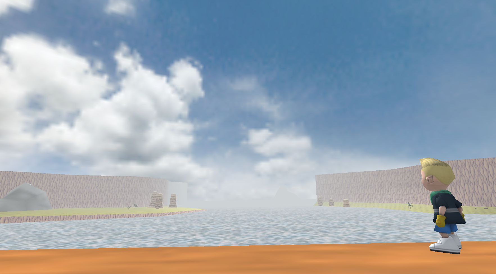

# Homebound

[Read More About Homebound64](https://portfolium.com/entry/homebound-64)

Homebound 64 is an homage to the never-released Earthbound 64 game by Nintendo. Contracted on Fiverr, development of this game began in Novemeber 2022. Since then, character models were created and I was tasked with animating the main character to be a mix of Banjo Kazooie and Link from The Legend of Zelda Ocarina of Time. Additionally, I developed the core gameplay mechanics including player movement, collision-based interactions (NPC's, level changing, fishing), and cinematic sequences in the form of a start screen and NPC cutscenes.

The scipts above are core gameplay scripts used to move and animate the character, as well as change scenes via trigger colliders to paint the world as a series of interconnected environments.

